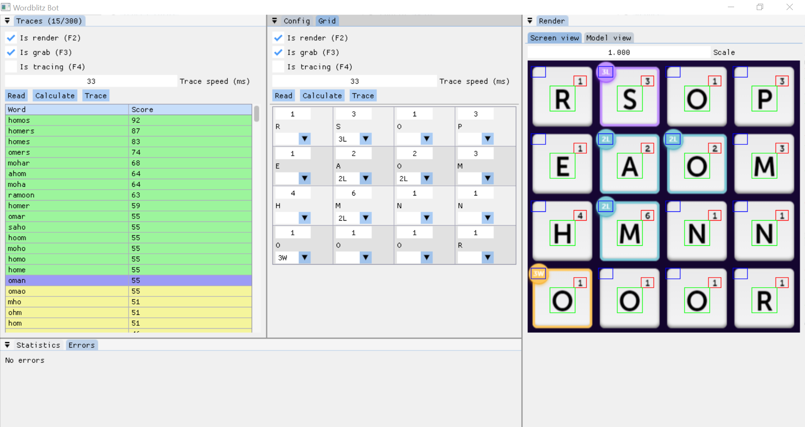

# Introduction
A bot for playing wordblitz made in C++
- Uses windows api for mouse movement and screen grabbing
- Uses tensorflowlite c api for loading and parsing quantized model
- Serialises dictionary as a tree structure

# Preview
